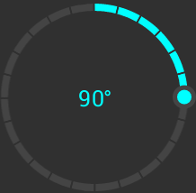

CirclePicker
===========

CirclePicker is an alternative to the built-in NumberPicker view in Android. It provides an easy to
use, easy to customize widget with a modern look and feel.

Features supported by the library:
 * Pick a number by turning a wheel
 * Format the displayed value using ValueFormatters
 * Use discrete steps
 * Set independent positive and negative limits which can be indeterminate
 * Wrap around function: turn the wheel multiple times to keep increasing or decreasing its value
 * Set the value for a full 360° rotation
 * Choose a starting point where the 0 value will be located
 * Show a divider between the discrete values
 * Independent styling of the wheel, the pointer and the value text
 * More to come

*Note:* At this moment this library is under heavy development and _will_ change. Until the first
release, use it with this fact in mind. Thank you.

Usage
-----------

Add the following to your `build.gradle`:

 ```gradle
repositories {
	maven { url "https://jitpack.io" }
}

dependencies {
	compile 'com.github.bugadani:circliepicker:-SNAPSHOT'
}
```

Other than this you can, of course, clone this repository and compile it yourself.

Screenshots
-----------


